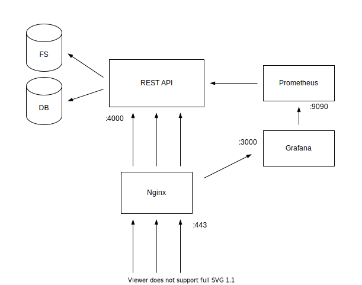
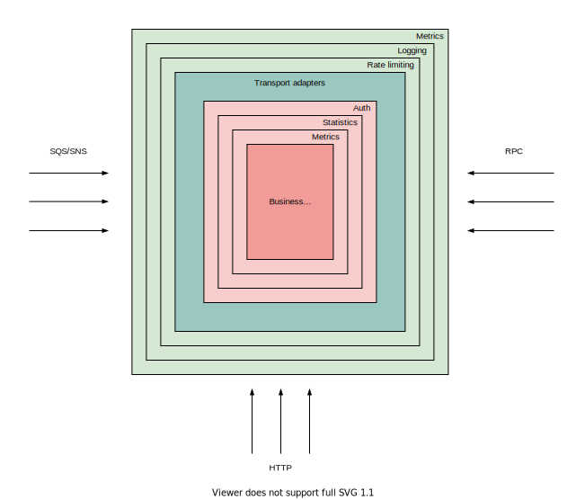

# Snap Vault

Snap Vault is a project made to share, illustrate and discuss patterns and best practices for REST APIs and servers
written in Go. Discussions, new proposals and PRs are encouraged and appreciated. The project is thoroughly commented
in order to illustrate and motivate the logic of the code.

Snap Vault is a simple REST API that performs CRUD operations on galleries and images. The application incorporates
an authentication system built on top of the concepts of users, keys and permissions. The focus of the project is not
on the features of the API but on the software structure and layout.

The repository contains additional scripts and configuration files useful to deploy the REST API on a remote machine 
and to monitor the runtime behaviour of the application (with Prometheus + Grafana). 

The project is composed of:
- the Snap Vault API application
- the Snap Vault CLI application
- database migrations (postgres)
- deploy scripts and systemd units
- a lot of in-code explanations


## Architecture 

The public interface of the system is a Nginx instance which acts as a reverse proxy. Nginx redirects HTTP requests
to the REST API, aka our Go application. The API have exclusive access to the Postgres database and writes data into the 
file system (in a specific _storage_ directory). The REST API binds to the loopback interface, so it isn't publicly 
accessible. The API responses flow back through Nginx to reach the clients.

Let's talk about monitoring. The private Prometheus instance is configured to scrape metrics from the instrumented Go 
application and exposes them to the Grafana server, which periodically polls Prometheus. Nginx will redirect requests
starting with _/grafana_ to the grafana dashboard (protected with its own auth system). Additionally, the _/metrics_ 
endpoint of the REST API is blocked by Nginx since it exposes the (sensitive) app metrics. Indeed, this endpoint is 
used by Prometheus to poll the application.



## Project structure

The architectural pattern used in this project is influenced by the hexagonal architecture. It means, among several
things, that the business logic should have no knowledge of transport-related concepts. Your core services shouldn’t 
know anything about HTTP headers, gRPC error codes or any other adapter used to expose them to the world. Applying the
principle to the Go language, Go-kit was inspirational about this. I suggest taking a look at it at https://gokit.io/. 
However, I decided to drastically reduce the complexity of go-kit by not following exactly the same patterns used there.

The project is laid out in two layers.

1. Transport layer. The transport layer is bound to concrete transports like JSON-over-HTTP, XML-over-HTTP or gRPC. 
No business logic is implemented here, the goal of this layer is to expose your services to the world by creating 
transport specific adapters, like for HTTP, RPC, CLI, events, etc.

2. Service layer. This layer is where all the business logic is implemented. Typically, each service method is exposed
in a single transport endpoint. Services shouldn't have any knowledge about the transport layer.  

Both the layers could be wrapped with middlewares to add functionalities, such as logging, rate limiting, 
metrics, authentication and so on. It’s totally fine to chain multiple middlewares around an endpoint or service. 

The division in these layers and the middleware (decorator) pattern enforce a stricter separation of concerns and 
allows us to reuse code. Starting from a complete service layer, adding a new transport is just a matter of writing 
some adapter functions. 



## Services

As anticipated above, services implement all the business logic of the application. They are agnostic of the concrete
transport methods used to expose them to the world. In other words, you can reuse the same service to provide similar 
functionalities to a JSON REST API server, to a CLI, to an RPC server and so on. Services are modelled as interfaces.
By using interfaces, you enforce the fact that transport adapters couldn't introspect you business logic.

In practice, services of this project are modeled as concrete implementations of an interface defined specifically for 
a specific domain area (users, galleries and so on). Service middlewares also satisfy the same interface, so they can 
be chained together and with the core service to provide additional functionalities and to enhance **composability**.

The following code snippet puts the concept in practice. It is only a trivial example, but it could help to grasp the
idea. 

First of all we define an abstract interface for our service.

```go
package booking

// Define the service interface.
type Service interface {
    ListRooms(ctx context.Context, page int) ([]Room, error)
    BookRoom(ctx context.Context, userID, roomID int64, people int) (Reservation, error)
    UpdateReservation(ctx context.Context, reservationID int64, people int) error
    DeleteReservation(ctx context.Context, reservationID int64, people int) error
    ConfirmAndPay(ctx context.Context, reservationID int, bankAccount string) error
}

type Reservation struct {
    ID      int64
    UserID  int64
    RoomID  int64
    Price   int
    People  int
}

type Room struct {
    ID      int64
    Name    string
    Prince  int
}
```

Then we provide at least one concrete implementation of the interface. Here we hypothetically save the data in a 
relational database and we contact some payment service.

```go
package booking
 
// Define a struct that holds shared dependencies and 
// make sure it implements the Service interface.
type SimpleService struct {
    Store         store.Models
    Logger        log.Logger
    BankEndpoint  string
}

func (ss *SimpleService) ListRooms(ctx context.Context, page int) ([]Room, error) {
    // List available rooms, retrieving data from the database.
}

func (ss *SimpleService) BookRoom(ctx context.Context, userID, roomID int64, people int) (Reservation, error) {
    // Reserve the room into the DB for the user and return back reservation data.
}

func (ss *SimpleService) UpdateReservation(ctx context.Context, reservationID int64, people int) error {
    // Update the number of people for the reservation, making sure the room has enough space.
}

func (ss *SimpleService) DeleteReservation(ctx context.Context, reservationID int64, people int) error {
    // Delete an existing reservation identified by the provided ID, the room will be available again.
}

func (ss *SimpleService) ConfirmAndPay(ctx context.Context, reservationID int, bankAccount string) error {
    // Confirm an existing reservation and charge the user by contacting a payment service.
}
```

Finally, our service can be used from other parts of the application.

```go
package main

// Define an interface variable and assign the 
// concrete implementation to it.
var bookingService booking.Service

bookingService = booking.SimpleService{store, logger, "https://bank-endpoint"}

res, err := bookingService.BookRoom(ctx, userID, roomID, people)
if err != nil {
    // ...
}
```

### Service middlewares
Above, we defined an interface to our booking service. We can create some middlewares to provide additional functionalities
to our service. Service middlewares will satisfy the same interface, so they can be chained together and wrap the core
service.

Service middlewares should provide business-logic related features, while transport related features could be provided
by transport middlewares. In the next snippet, we define a metrics middleware to record statistics about our service
utilization.

```go
package booking 

type MetricsMiddleware struct {
    requestLatency  *prometheus.HistogramVec
    requestCount    *prometheus.CounterVec
    Service
}

func NewMetricsMiddleware(next Service) *MetricsMiddleware {
    // Create and register needed Prometheus metrics, a.k.a instrument 
    // the code with Prometheus counters, gauges and histograms.
    // ...

    return &MetricsMiddleware {
        requestLatency: requestLatency,
        requestCount: requestCount, 
        Service: next,
    }
}

func (mm *MetricsMiddleware) ListRooms(ctx context.Context, page int) ([]Room, error) {
    defer func(start time.Time) {
        mm.requestLatency.WithLabelValues("list-rooms").Observe(time.Since(start).Seconds())
        mm.requestCount.WithLabelValues("list-rooms").Inc()
    }(time.Now())

    return mm.Service.ListRooms(ctx, page)
}

// Implement all other methods.
``` 

Note the following two things.
- We embed the _next_ Service (another mw or the core service) in the middleware in order to implement automatically
the defined interface. When needed, we override methods.

- The 'core' service could be entirely skipped on behalf of the middleware. In an auth middleware for example, the 
method could return early if the user doesn't have enough permissions.

- You can record metrics on the transport layer, on the service layer, or both. In the project I collect metrics
only in the transport layer.

Finally, we can wire everything together, typically in our main function. The order of the middlewares
could be changed based on your specific needs (the auth middleware is not implemented here for brevity).

```go
package main 

var bookingService booking.Service

bookingService = booking.SimpleService{store, logger, "https://bank-endpoint"}
bookingService = booking.AuthMiddleware{authenticator, bookinService}
bookingService = booking.NewMetricsMiddleware(metrics, bookingService)

// The method call will pass through (in order): the metrics middleware, the
// authentication middleware and eventually the core booking service. 
res, err := bookingService.BookRoom(ctx, userID, roomID, people)
if err != nil {
    // ...
}
```

## Transports

We defined our services and all related middlewares, now we have to expose the service to the outside. The transport 
layer is related to concrete transports like JSON over HTTP or gRPC. No business logic should be implemented here.

Each type of transport has its own peculiarities and nuances, but all implementations follow this pattern:
- a handler is defined for each service method/API (not a strict rule)
- the handler extracts and decodes relevant data from the request
- the handler passes the collected data to the service method
- the output is encoded and sent to the client  

We will implement JSON-over-HTTP adapters to the service defined previously. This layer can be modelled using closures 
(returning HTTP handlers) or using a struct whose methods are HTTP handlers themselves. The choice is not vital. In the
Snap Vault project the second approach was followed.

```go
package main 

// Define a jsonapi struct that holds the core services and some additional dependency,
// then in the same package define the HTTP handlers.
type jsonapi struct {
    booking booking.Service     
    users   users.Service
    logger  log.Logger
} 

func (j *jsonapi) listRoomsHandler(w http.ResponseWriter, r *http.Request) {

    // Extract data from the request.
    query := r.URL.Query()
    page, err := strconv.Atoi(query.Get("page"))
    if err != nil {
        page = 0
    }

    // Call the service method.
    rooms, err := j.booking.ListRooms(r.Context(), page)
    if err != nil {
        // handle the error
        return
    }

    // Encode and send the service response. 
    roomsBytes, err := json.Marshal(rooms)
    if err != nil {
       // handle the error
        return
    }
    w.Write(roomsBytes)
}

// Other HTTP handlers implementations.
```

The last step is to register our routes and start the server. You can use the routing utility you want, here I used 
the gorilla/mux router.

```go
package main

router := mux.NewRouter()

router.Methods(http.MethodGet).Path("/booking/rooms").HandlerFunc(api.listRoomsHandler)
router.Methods(http.MethodPost).Path("/booking/rooms/{id}").HandlerFunc(api.bookRoomHandler)
router.Methods(http.MethodPut).Path("/booking/rooms/{id}").HandlerFunc(api.updateReservationHandler)
router.Methods(http.MethodDelete).Path("/booking/rooms/{id}").HandlerFunc(api.deleteReservationHandler)
router.Methods(http.MethodPost).Path("/booking/rooms/confirm/{id}").HandlerFunc(api.confirmationHandler)

err := http.ListenAndServe("127.0.0.1:4000", router)
if err != nil {
    log.fatal(err)
}
```

In the same way we can define transport-specific adapters for a gRPC server, for a CLI, for a SQS polling system and so
on. 

### Transport middlewares

Transport middlewares are not modelled following an interface, but are specific for each transport method. For HTTP
middlewares there is a well-known pattern to create middlewares.

```go
func httpMiddleware(next http.Handler) http.Handler {
	return http.HandlerFunc(func(w http.ResponseWriter, r *http.Request) {
        // Do something before serving the request.
		
        next.ServeHTTP(w, r)
    
        // Do something after the request was served.
	})
}
```

The pattern takes advantage of closures to return a wrapped version of the original HTTP handler. It is possible
to wrap a single endpoint or to the entire HTTP handler passed to the http.ListenAndServe function. 

```go
router := mux.NewRouter()

// Apply some middlewares to a single endpoint...
listRoomsHandler := middleware1(api.listRoomsHandler)
listRoomsHandler = middleware2(listRoomsHandler)

router.Methods(http.MethodGet).Path("/booking/rooms").HandlerFunc(listRoomsHandler)


// ... or globally to the resulting HTTP handler.
handler := middleware3(router)
handler = middleware4(handler)

err := http.ListenAndServe("127.0.0.1:4000", handler)
if err != nil {
    log.fatal(err)
}
```

In the Snap Vault codebase several middlewares were used, all related to HTTP related issues:
- metrics 
- logging
- rate-limiting
- CORS authorization
- auth key extraction


#### A note on authentication 

It is usual to perform authentication in an HTTP middleware, especially if the project doesn't enforce the separation
between transport and business logic (services). This pattern is not followed here.

The reason is that authentication & authorization are part of the business logic and should be performed inside the
service layer (or in a dedicated service middleware). This results in more code but will result in a cleaner code, 
and a better separation of concerns. The transport middleware is still responsible to extract the authentication data
from a transport-specific location, i.e. the Authorization header for HTTP requests.

This point is debatable, and it is perfectly acceptable to perform authentication in a transport middleware.
Software engineering involves trade-offs, and valuable exceptions could be made. Note however that DRY code
is not always cleaner code.


## Data persistence

Storing and retrieving data is typically part of the business logic. For simple data manipulation it is sufficient to 
pass a sql.DB pointer to the services concrete implementations. For more than trivial operations you usually want to
create a storage package with a concrete `Store` type. This type will hold the concrete db connection pool and provides
operations on data, implemented as methods. Then, the `Store` type is provided to the service layer.

```go
package storage

type Store struct {
    logger log.Logger
    db     *sql.DB
}

func (s *Store) InsertReservation(ctx context.Context, res Reservation) error {
    row := s.db.QueryRow(`
        INSERT INTO reservation (userID, roomID, people) 
        VALUES ($1, $2, $3)
        RETURNING id, created_at
    `, res.UserID, res.RoomID, res.People)

    return row.Scan(
        &res.ID, 
        &res.CreatedAt,
    )
}
```

Even better, it is possible to define an interface also for persistence operations. Each concrete implementation could 
support a different type of storage, e.g. file system, S3, another storage microservice etc. In this case you provide 
an interface rather than a concrete type to your services.


## Running the binaries

Binary packages (aka main) are scoped under the cmd directory. The REST API reads the JSON config file location from 
a path specified via the `config` flag (defaults to `./conf/api.dev.json`). You can find an example configuration file 
at `./conf/api.example.json`. This file must be edited with valid values before starting the application.

The API could be directly started: 

```shell script
go run ./cmd/api -config <path/to/config/file>
```

or it can be compiled:

```shell script
make build
./bin/linux/snapvault-cli_<git_desc> -config <path/to/config/file>
```

Under the cmd directory there is also a simple CLI. Currently, it supports only the `migrate` command, but in the future
it could be extended to support additional features. The _migrate_ command uses the https://github.com/golang-migrate/migrate
module embedded as a library.

```shell script
go run ./cmd/cli --help # obtain help for the CLI

go run ./cmd/cli migrate --help # obtain help for the migrate command

go run ./cmd/cli migrate \
  --action up  \
  --migrations-folder file://<path/to/migrations/folder>  \
  --database-url  postgres://localhost:5432/database?sslmode=disable
```


## Deploy
The _deploy_ folder contains several files related to the deploy of the application. Note that values and paths in these
files must be edited with correct values for you specific needs (example: the domain snapvault.ablab.dev will not work 
since it is already owned).

The _nginx_ directory has configuration files to setup an Nginx instance which will act as a reverse proxy between public
requests and our REST API. The _prometheus_ directory contains the configuration file and the systemd unit for Prometheus. 
The _api_ directory contains the systemd unit for the REST API.

The makefile contains a command to provision a single machine (`remote/provisioning`), that is, it installs nginx, postgres, 
prometheus and grafana. The makefile rule will upload all necessary files and execute the `prep.sh` bash script. 

A second command could be used to deploy our API (`remote/deploy`) on that machine and run the db migrations. All necessary
files are uploaded and the API is started as a systemd unit (all operations are done by the _snapvault_ user). The _deploy_ 
rule will override and remove the eventual previously deployed instance of the API. The `deploy.sh` will be run as part of the 
workflow.

Both commands will stop if they not found the REMOTE_IP env var set (which must be set to the remote machine IP).

Again, values in the deploy directory and in the makefile should be edited with your specific values. Note that **the deploy 
workflow presented in this project is simplistic because is not the focus of the project**. 


Note: working on Ubuntu 20.04.


